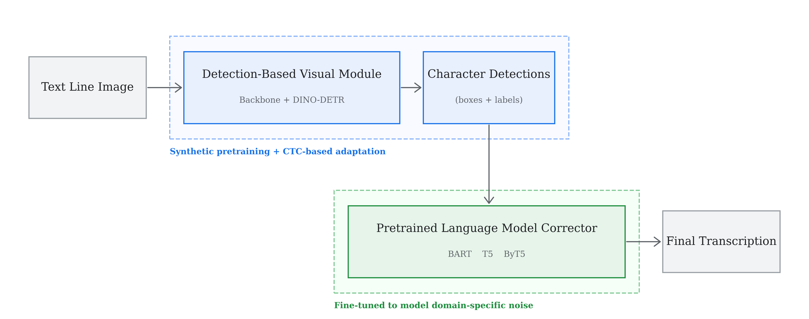

# Efficient Domain Adaptation for Text Line Recognition via Decoupled Language Models

Official implementation of the paper **"Efficient Domain Adaptation for Text Line Recognition via Decoupled Language Models"** (MiTA 2026 Oral Presentation).

## 📢 TL;DR

Modern end-to-end OCR transformers (e.g., TrOCR) require hundreds of GPU hours for domain adaptation due to tightly coupled vision-language training.

This project implements a modular detection-and-correction OCR architecture and introduces a fully annotation-free domain adaptation pipeline. Instead of retraining large vision-language stacks, we fine-tune pretrained language models (T5/ByT5/BART) using structured synthetic noise (e.g., “Cursive-Collapse”) to simulate realistic OCR errors.

**Key Contributions:**

- Zero labeled target images required

- Systematic evaluation of token-level vs byte-level correction across modern and historical domains

- **~95% reduction in adaptation cost** (~4.5 GPU hours on a single A100)

- Near state-of-the-art accuracy on CVL and historical manuscripts

## Key Discovery: A Domain-Aware Pareto Frontier

Our cross-domain evaluation shows that language model selection must be domain-specific:

- **T5-Base** performs best on modern handwriting (CVL: 1.90% CER, IAM: 5.40%) by leveraging strong pretrained lexical priors.

- **ByT5-Base** outperforms T5 on historical manuscripts (GW: 5.35% vs. 5.86% CER) by avoiding subword tokenization collapse and reconstructing archaic spellings at the byte level.

## Architecture

  

